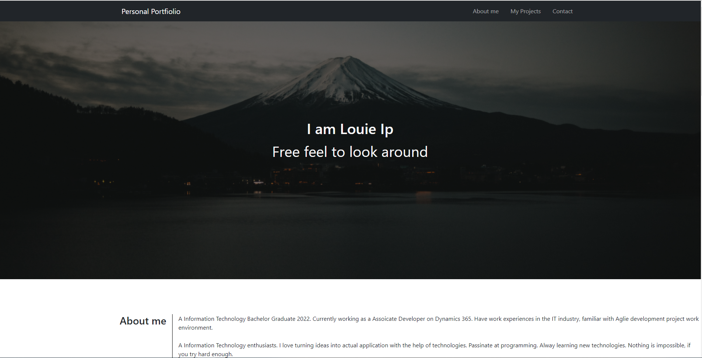
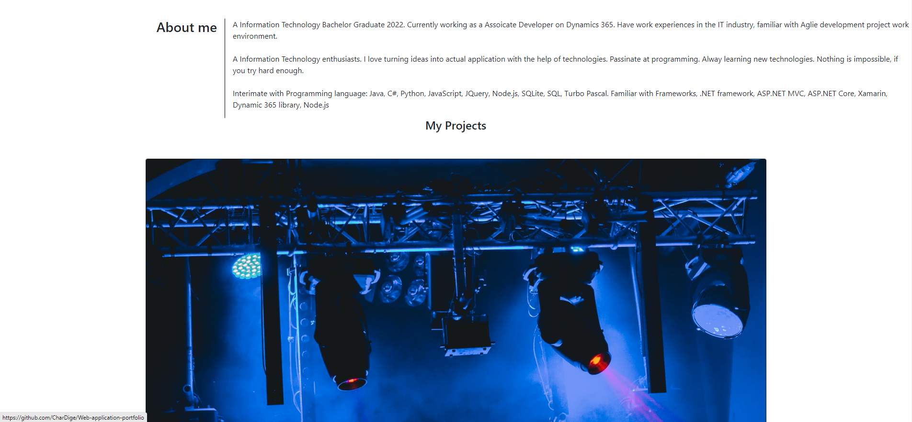
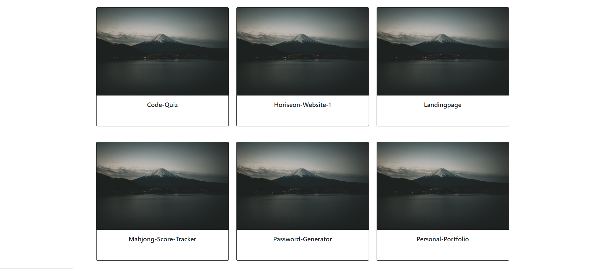

# Updated-Personal-Portfolio

My Personal GitHub Portfolio

## Description

This application shows all the Programming project that I have created and shared online.

## Table of Content

  - [Feature](#feature)
  - [Installation](#installation)
  - [Usage](#usage)
  - [Credits](#credits)
  - [License](#license)

## Feature

Create a Markdown file which suits your personal project needs.

## Installation

No Installation for this project. 

## Usage

## Credits

Github, shield.io

## License
[MIT License - Copyright (c) 2022 Louie Ip](./LICENSE)